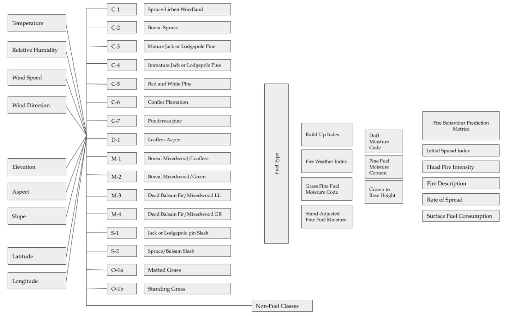
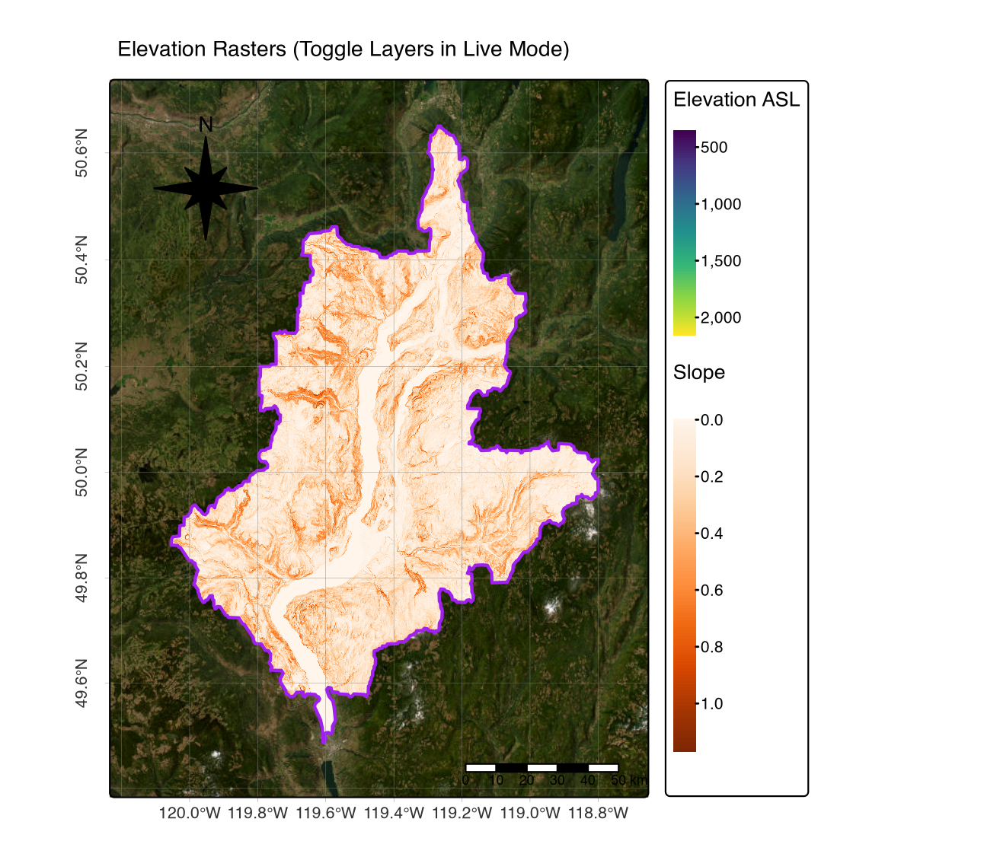
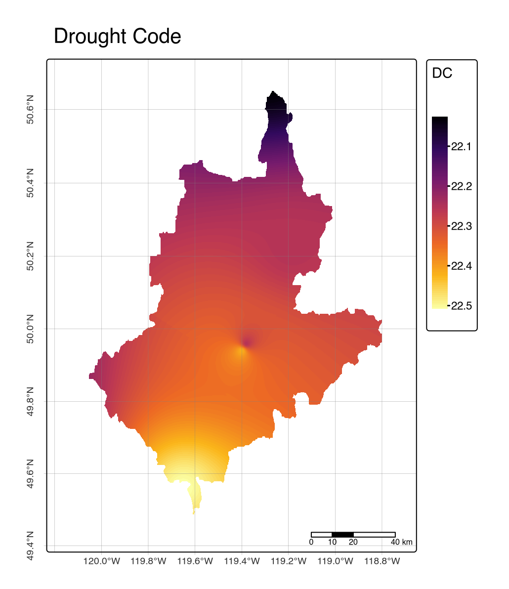
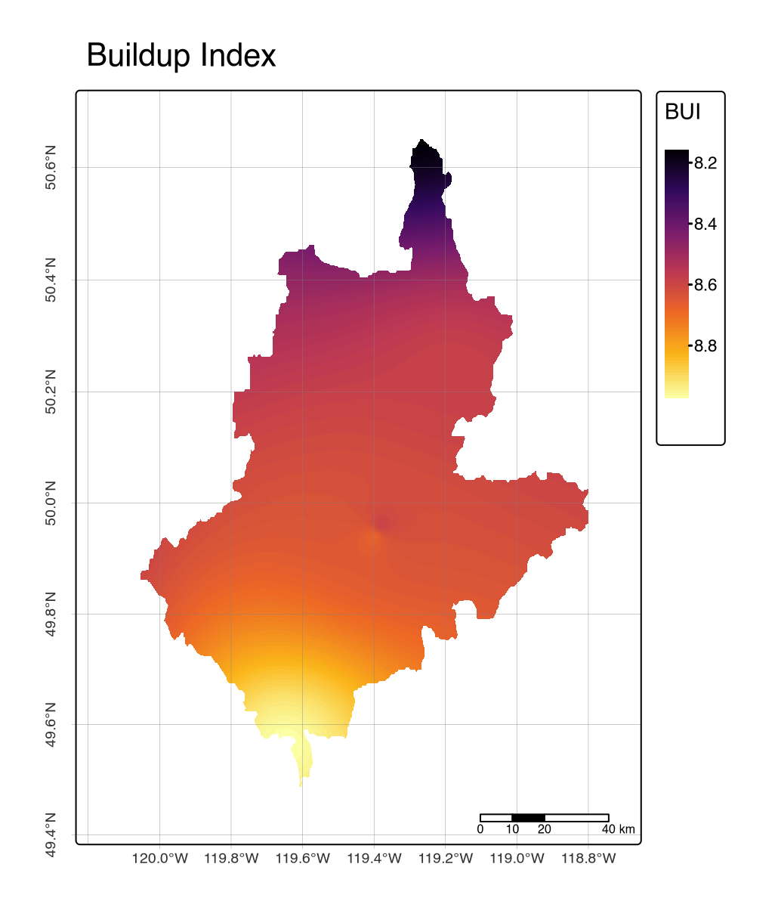

```{r setup}
#| warning: false
#| message: false
#| error: false
#| echo: false


pacman::p_load(
  "devtools",
  "bibtex",
  "cffdrs", "curl", "cols4all", "chromote",
  "dplyr",
  "elevatr", "ellmer",
  "gstat", "geonetwork",
  "htmltools", "httr2",
  "janitor",
  "kableExtra", "knitr",
  "lutz", 
  "mapedit",
  "ncdf4",
  "openxlsx","OpenStreetMap", "osmdata",
  "pandoc", "pandocfilters", "PROJ",
  "raster", "rasterVis", "reproj", "rmapshaper", "renv", "rmarkdown",
  "sf",
  "tinytex", "tmap", "tmaptools", "terra", "tmap.networks", "tmap.glyphs", "tmap.cartogram",
  "useful", "usethis", 
  "weathercan")

knitr::opts_chunk$set(
  echo = TRUE, 
  message = FALSE, 
  warning = FALSE,
  error = TRUE, 
  comment = NA, 
  tidy.opts = list(
    width.cutoff = 60)
  ) 

sf::sf_use_s2(use_s2 = FALSE)
options(htmltools.dir.version = FALSE, 
        htmltools.preserve.raw = FALSE)
tmap_options(max.raster = c(plot = 9500000, view = 10000000)) # allows large raster rendering
#renv::init()
#renv::restore()
#renv::install(c("knitr", "rmarkdown"))
#renv::snapshot()
```

```{css, echo=FALSE, class.source = 'foldable', eval=F}
div.column {
    display: inline-block;
    vertical-align: top;
    width: 50%;
}

#TOC::before {
  content: "";
  display: block;
  height:200px;
  width: 200px;
  background-image: url("https://avatars.githubusercontent.com/u/81122008?s=200");
  background-size: contain;
  background-position: 50% 50%;
  padding-top: 80px !important;
  background-repeat: no-repeat;
}
```

## 1. Introduction

The Canadian Forest Fire Danger Rating System (CFFDRS) has served as the scientific foundation for wildland fire management in Canada. The next generation of the CFFDRS (V2.0) includes several enhancements designed to incorporate new data sources and address the increasing complexity of contemporary fire management [@boucher]. This report provides a reproducible pipeline using the `cffdrs` R package to derive key fire behavior metrics. Our workflow develops raster layers of fuel moisture codes and wildfire weather indices. These inputs are used to inform the stand-adjusted fine-fuel model [@wotton2007stand] and classify vegetation into fuel classes based on the BC forest fuel typing framework [@perrakis2018british; @perrakis2023improved]. The resulting fuel type rasters are compiled to predict fire behavior, from which we derive Head Fire Index (HFI) and Fire Intensity (FI) maps for the Okanagan Watershed Basin for the 2021 fire season. The full workflow is illustrated in the flowchart below.

{fig-align="center"}

#### Clone repository

This guide enables reproducible analysis by cloning the supporting repository using the following bash commands in your terminal:

``` r
git clone https://github.com/seamusrobertmurphy/wildfire-fuel-mapping-CFFDRS-2.0.git
```

## 2. Method

#### Import AOI Data

Two input options for selecting AOI were explored below: 1) uploading AOI boundary file and 2) choosing point location as centre of 10km LxW bounding box. We downloaded the Okanagan Watershed boundary [(FWA ID:212)](https://www2.gov.bc.ca/gov/content/data/geographic-data-services/topographic-data/freshwater) and transformed into spatVector for implementing workflow using `terra` functions.

```{r}
#| warning: false
#| message: false
#| error: false
#| echo: true
#| eval: false

download.file(
  url      = "https://data.hydrosheds.org/file/HydroBASINS/customized_with_lakes/hybas_lake_na_lev06_v1c.zip",
  destfile = "./assets/SHP/watersheds_na_l6.zip",
  mode     = "wb"
  )

unzip(
  zipfile = "./assets/SHP/watersheds_na_l6.zip",
  exdir   = "./assets/SHP/"
  )

xy         = "49.95,-119.43"
watersheds = sf::st_read("./assets/SHP/watersheds_na_l6/hybas_lake_na_lev06_v1c.shp")
aoi_xy     = sf::st_read("./assets/SHP/aoi_xy.shp")
aoi        = watersheds |> sf::st_intersection(aoi_xy) 
sf::st_write(aoi, "./assets/SHP/aoi_watershed.shp")

tmap::tmap_mode("view")
tmap::tm_shape(aoi) + tmap::tm_borders(col="purple", lwd=2) +
  tmap::tm_scalebar(position=c("RIGHT", "BOTTOM"), text.size = .5) +
  tmap::tm_title("AOI Waterhsed", size=.8) 
```

```{r}
#| warning: false
#| message: false
#| error: false
#| comment: NA
#| echo: false
#| eval: true

aoi = sf::st_read("./assets/SHP/aoi_watershed.shp", quiet=T)

tmap::tmap_mode("view")
tmap::tm_shape(aoi) + tmap::tm_borders(col="purple", lwd=2) +
  tmap::tm_scalebar(position=c("RIGHT", "BOTTOM"), text.size = .5) +
  tmap::tm_title("AOI Waterhsed", size=.8)
  #tmap::tm_compass(color.dark="gray60",text.color="gray60",position=c("RIGHT","top"))+
  #tmap::tm_graticules(lines=T,labels.rot=c(0,90),lwd=0.2) +
  #tmap::tm_layout(legend.position=c("left", "top"), legend.bg.color = "white") +
  #tmap::tm_basemap("Esri.WorldImagery") 
  #tmap::tm_basemap("OpenStreetMap") 
  #tmap::tm_basemap("OpenTopoMap") 
```

#### Import DEM Data

Topography is a primary driver of fire behavior, influencing fire spread, intensity, and fuel moisture. This section details a reproducible workflow for acquiring Digital Elevation Model (DEM) data and its derivatives. The following chunk begins by acquiring a `DEM` raster for the `AOI` using the `elevatr` package [@elevatr]. From this dataset, slope and aspect rasters were derived. All three layers were then processed using the `terra` package to ensure a consistent spatial alignment and extent. Make sure to toggle layers on and off to inspect visually.

```{r}
#| warning: false
#| message: false
#| error: false
#| comment: NA
#| echo: true
#| eval: false

elev  = elevatr::get_elev_raster(aoi, z=11) # res==zoom -> https://github.com/tilezen/joerd/blob/master/docs/data-sources.md#what-is-the-ground-resolution
raster::writeRaster(elev, "./assets/TIF/elevation.tif", overwrite=T)

slope = raster::terrain(elev, 
  opt       = "slope", 
  neighbors = 8,
  overwrite = T,
  filename  = "./assets/TIF/slope.tif"
  )

aspect = raster::terrain(elev, 
  opt       = "aspect", 
  neighbors = 8,
  overwrite = T,
  filename  = "./assets/TIF/aspect.tif"
  )

# Tidy elevation rasters
elev  = terra::rast("./assets/TIF/elevation.tif") |> terra::project("EPSG:3857")
slope = terra::rast("./assets/TIF/slope.tif") |> terra::project("EPSG:3857")
aspect= terra::rast("./assets/TIF/aspect.tif") |> terra::project("EPSG:3857")
slope = terra::resample(slope, elev, method="bilinear")
aspect= terra::resample(aspect, elev, method="bilinear")
slope = terra::mask(slope, terra::vect(sf::st_transform(aoi, "EPSG:3857")))
aspect= terra::mask(aspect, terra::vect(sf::st_transform(aoi, "EPSG:3857")))
elev  = terra::mask(elev, terra::vect(sf::st_transform(aoi, "EPSG:3857")))
raster::writeRaster(elev, "./assets/TIF/elevation.tif", overwrite=T)
raster::writeRaster(slope, "./assets/TIF/slope.tif", overwrite=T)
raster::writeRaster(aspect, "./assets/TIF/aspect.tif", overwrite=T)


tmap::tm_shape(elev)+ tm_raster(
	style= "cont", title="Elevation ASL", palette="viridis")+
  tmap::tm_shape(slope)+ tm_raster(
  	style= "cont", title="Slope", palette="Oranges") +
  tmap::tm_shape(aoi)+ tm_borders(col="purple", lwd = 2) +
  tmap::tm_compass(type = "8star", position = c("left", "top")) +
  tmap::tm_scale_bar(c(0, 10, 20, 40), position = c("RIGHT", "BOTTOM"), text.size = .5) +
  tmap::tm_title("Elevation Rasters", size=0.8) +
  tmap::tm_basemap("Esri.WorldImagery") 
```

```{r}
#| warning: false
#| message: false
#| error: false
#| comment: NA
#| echo: false
#| eval: false
elev  = terra::rast("./assets/TIF/elevation.tif")
slope = terra::rast("./assets/TIF/slope.tif")
aspect = terra::rast("./assets/TIF/aspect.tif")

tmap::tm_shape(elev)+ tm_raster(style= "cont", title="Elevation ASL", palette="viridis")+
  tmap::tm_shape(slope)+ tm_raster(style= "cont", title="Slope", palette="Oranges") +
  tmap::tm_shape(aoi)+ tm_borders(col="purple", lwd = 2) +
  tmap::tm_compass(type = "8star", position = c("left", "top")) +
  tmap::tm_scalebar(position=c("RIGHT", "BOTTOM"), text.size = .5) +
  tmap::tm_title("Elevation Rasters", size=.8) +
  tmap::tm_basemap("Esri.WorldImagery") 

```



#### Import Climate Data

Climate data, a fundamental input for wildfire weather calculations, is sourced from Environment and Climate Change Canada using the `weathercan` package. This approach replaces the manual data sourcing from platforms with reproducible, verifiable solution. The workflow begins by searching for all weather stations within a specified radius of the AOI. Hourly data for these stations is downloaded for the defined date range and then aggregated to a single mean value for each station for the target period. The cleaned, point-based spatial data is converted into continuous raster layers for each input variable, which are derived using Inverse Distance Weighting (IDW) method via a `gstat` model and the `terra::interpolate` function. The resulting outputs of mean daily temperature, precipitation, relative humidity, and wind speed are then masked to the AOI and saved for use in the next stages of the analysis.

```{r}
#| warning: false
#| message: false
#| error: false
#| comment: NA
#| echo: true
#| eval: false

# Search weather stations
stations_100km = weathercan::stations_search(
  coords  = c(49.95,-119.43), 
  interval= "day",
  dist    = 100)

# Parse by station
stations_ids_unique <- stations_100km |>
  dplyr::pull(station_id) |> unique()

# Download data for all selected stations
climate_tbl <- weathercan::weather_dl(
  station_ids = stations_ids_unique,
  start = "2021-06-01",
  end = "2021-10-01",
  interval = "hour") # relative humidity in hourly only

# Aggregate by station
aggregated_data <- climate_tbl |>
  dplyr::group_by(station_id, lat, lon) |>
  dplyr::summarise(
    mean_temp = mean(temp, na.rm = TRUE),
    mean_prec = mean(prec_amt, na.rm = TRUE),
    mean_rh   = mean(rel_hum, na.rm = TRUE),
    mean_ws   = mean(wind_spd, na.rm = TRUE)
  ) |>
  dplyr::ungroup()

# Convert to spatial and filter missing stations
climate_sf <- aggregated_data |>
  dplyr::filter(
    !is.nan(mean_temp),
    !is.nan(mean_prec),
    !is.nan(mean_rh),
    !is.nan(mean_ws)
  ) |>
  sf::st_as_sf(
    coords = c("lon", "lat"),
    crs = 4326
  ) |>
  sf::st_transform("EPSG:3857")

# Derive raster template to interpolate on top of
raster_template <- terra::rast("./assets/TIF/elevation.tif")

# Derive function to handle `sf` weather station data
interpolate_stations <- function(model, x, crs, ...) {
	v <- st_as_sf(x, coords = c("x", "y"), crs = crs)
	p <- predict(model, v, ...)
	as.data.frame(p)[, 1:2]
  }

# Create Inverse Distance Weighting models using gstat.pkg
temp_idw <- gstat(
  formula = mean_temp ~ 1, 
  locations = climate_sf,
  nmax = 8, 
  set = list(idp = 2.0) 
  )

prec_idw <- gstat(
  formula = mean_prec ~ 1, 
  locations = climate_sf,
  nmax = 8, 
  set = list(idp = 2.0) 
  )

rh_idw <- gstat(
  formula = mean_rh ~ 1, 
  locations = climate_sf,
  nmax = 8, 
  set = list(idp = 2.0) 
  )

ws_idw <- gstat(
  formula = mean_ws ~ 1, 
  locations = climate_sf,
  nmax = 8, 
  set = list(idp = 2.0) 
  )


# Spatially interpolate using terra.pkg
temp_rast <- terra::interpolate(
  object = raster_template,
  model = temp_idw,
  fun = interpolate_stations,
  crs = "EPSG:3857",
  debug.level = 0
)

prec_rast <- terra::interpolate(
  object = raster_template,
  model = prec_idw,
  fun = interpolate_stations,
  crs = "EPSG:3857",
  debug.level = 0
)

rh_rast <- terra::interpolate(
  object = raster_template,
  model = rh_idw,
  fun = interpolate_stations,
  crs = "EPSG:3857",
  debug.level = 0
)

ws_rast <- terra::interpolate(
  object = raster_template,
  model = ws_idw,
  fun = interpolate_stations,
  crs = "EPSG:3857",
  debug.level = 0
)

# Tidy, save, and visualize
temp    = terra::mask(temp_rast, terra::vect(sf::st_transform(aoi, "EPSG:3857")))
prec    = terra::mask(prec_rast, terra::vect(sf::st_transform(aoi, "EPSG:3857")))
rh      = terra::mask(rh_rast, terra::vect(sf::st_transform(aoi, "EPSG:3857")))
ws      = terra::mask(ws_rast, terra::vect(sf::st_transform(aoi, "EPSG:3857")))

terra::writeRaster(temp, "./assets/TIF/temp.tif", overwrite=T)
terra::writeRaster(prec, "./assets/TIF/prec.tif", overwrite=T)
terra::writeRaster(rh, "./assets/TIF/rh.tif", overwrite=T)
terra::writeRaster(ws, "./assets/TIF/ws.tif", overwrite=T)

tmap::tmap_mode("plot")
tmap::tm_shape(temp)+ tm_raster(style= "cont", 
  title="Mean Daily Temperature (°C 2m AGL)", palette="Oranges")+
  tmap::tm_shape(aoi)+ tm_borders(col="purple", lwd = 2) +
  tmap::tm_compass(color.dark="gray60",text.color="gray60",position=c("RIGHT","top"))+
  tmap::tm_graticules(lines=T,labels.rot=c(0,90),lwd=0.2) +
  tmap::tm_scale_bar(c(0, 10, 20, 40), position = c("RIGHT", "BOTTOM"), text.size = .5) 

tmap::tm_shape(prec)+ tm_raster(style= "cont", 
  title="Mean Daily Precipitation (mm^3/day)", palette="Oranges") +
  tmap::tm_shape(aoi)+ tm_borders(col="purple", lwd = 2) +
  tmap::tm_compass(color.dark="gray60",text.color="gray60",position=c("RIGHT","top"))+
  tmap::tm_graticules(lines=T,labels.rot=c(0,90),lwd=0.2) +
  tmap::tm_scale_bar(c(0, 10, 20, 40), position = c("RIGHT", "BOTTOM"), text.size = .5) 
  
tmap::tm_shape(rh)+ tm_raster(style= "cont", 
  title="Relative Humidity (NCDC 2m AGL)", palette="Oranges") +
  tmap::tm_shape(aoi)+ tm_borders(col="purple", lwd = 2) +
  tmap::tm_compass(color.dark="gray60",text.color="gray60",position=c("RIGHT","top"))+
  tmap::tm_graticules(lines=T,labels.rot=c(0,90),lwd=0.2) +
  tmap::tm_scale_bar(c(0, 10, 20, 40), position = c("RIGHT", "BOTTOM"), text.size = .5) 

tmap::tm_shape(ws)+ tm_raster(style= "cont", 
  title="Wind Speed (m/s 10m AGL)", palette="Oranges") +
  tmap::tm_shape(aoi)+ tm_borders(col="purple", lwd = 2) +
  tmap::tm_compass(color.dark="gray60",text.color="gray60",position=c("RIGHT","top"))+
  tmap::tm_graticules(lines=T,labels.rot=c(0,90),lwd=0.2) +
  tmap::tm_scale_bar(c(0, 10, 20, 40), position = c("RIGHT", "BOTTOM"), text.size = .5) 
```

```{r}
#| warning: false
#| message: false
#| error: false
#| comment: NA
#| echo: false
#| eval: false

# Specific ordering is required by ccfdrs pkg
temp  = terra::rast("./assets/TIF/temp.tif")[[1]]
rh    = terra::rast("./assets/TIF/rh.tif")[[1]]
prec  = terra::rast("./assets/TIF/prec.tif")[[1]]
ws    = terra::rast("./assets/TIF/ws.tif")[[1]]

names(temp) = "temp"
names(rh)   = "rh"
names(prec) = "prec"
names(ws)   = "ws"
  
tmap::tmap_mode("view")
tmap::tm_shape(temp)+ tm_raster(style= "cont", 
  title="Mean Daily Temperature (°C 2m AGL)", palette="Oranges")+
  tmap::tm_shape(prec)+ tm_raster(style= "cont", 
  title="Mean Daily Precipitation (mm^3/day)", palette="Blues") +
  tmap::tm_shape(rh)+ tm_raster(style= "cont", 
  title="Relative Humidity (NCDC 2m AGL)", palette="Greens") +
  tmap::tm_shape(ws)+ tm_raster(style= "cont", 
  title="Wind Speed (m/s 10m AGL)", palette="Purples") +
  tmap::tm_shape(aoi)+ tm_borders(col="purple", lwd = 2) +
  tmap::tm_compass(color.dark="gray60",text.color="gray60",position=c("RIGHT","top"))+
  tmap::tm_graticules(lines=T,labels.rot=c(0,90),lwd=0.2) +
  tmap::tm_scale_bar(c(0, 10, 20, 40), position = c("RIGHT", "BOTTOM"), text.size = .5) 
```

+:-----------------------------------------------------------------------------------------------------------------------:+:---------------------------------------------------------------------------------------------------------------------:+
| {width="345"} | {width="345"} |
+-------------------------------------------------------------------------------------------------------------------------+-----------------------------------------------------------------------------------------------------------------------+
| {width="345"} | {width="345"} |
+-------------------------------------------------------------------------------------------------------------------------+-----------------------------------------------------------------------------------------------------------------------+

## 3. Results

#### Derive Fuel Type Maps

The Fire Behavior Prediction (FBP) system relies on a detailed and accurate classification of fuel types. This section demonstrates development of fuel maps from the publicly available BC Vegetation Resource Inventory (VRI) dataset downloaded from [BC Data Catalog](https://catalogue.data.gov.bc.ca/dataset/vri-2024-forest-vegetation-composite-polygons/resource/85724845-3973-4a26-b715-100306768bbc).

To ensure our inputs are correctly formatted for the `cffdrs` package, we reviewed the included example datasets, `test_fwi` and `test_fbp`, which serve as templates guiding input requirements and structure, as documented in the VRI data dictionary [here](https://www2.gov.bc.ca/assets/gov/farming-natural-resources-and-industry/forestry/stewardship/forest-analysis-inventory/data-management/standards/vegcomp_poly_rank1_data_dictionaryv5_2019.pdf).

Following the workflow of Wotton and Beverly's stand-adjusted fine-fuel moisture model [@wotton2007stand] and more recent methodologies [@perrakis2018british], we classified the VRI attributes into distinct fuel categories. This process extracted predictor variables, such as stand type and density, and applied a filtering process to classify fuel categories that are consistent with the FBP system. The resulting classified vector layers serve as the foundational fuel maps for all subsequent fire behavior predictions.

```{r}
#| warning: false
#| message: false
#| error: false
#| comment: NA
#| echo: true
#| eval: false

# Download
download.file(destfile = "./assets/VRI/vri_2024.zip", mode = "wb",
  url = "https://pub.data.gov.bc.ca/datasets/02dba161-fdb7-48ae-a4bb-bd6ef017c36d/current/VEG_COMP_POLY_AND_LAYER_2024.gdb.zip")
unzip(zipfile = "./assets/VRI/vri_2024.zip",
  exdir = "./assets/VRI/")

# Tidy & save
vri_2024  = sf::st_read("./assets/VRI/vri_2024.shp") |> 
  sf::st_intersects(sf::st_transform(aoi, "EPSG:3005")) |>
  sf::st_transform("EPSG:3857")
sf::st_write(vri_2024, ".assets/VRI/vri_2024_3857.shp")

# Input Requirements
library(cffdrs)
print(as_tibble(test_fwi), n = 10)
print(as_tibble(test_fbp), n = 10)
```

```{r}
#| warning: false
#| message: false
#| error: false
#| comment: NA
#| echo: false
#| eval: true
print(as_tibble(test_fwi), n = 10)
print(as_tibble(test_fbp), n = 10)
```

Wotton and Beverly's model of stand-adjusted fine fuel moisture content requires five predictor variables [@wotton2007stand]. Two of these predictors were extracted from the the VRI dataset including stand type (`SPEC_CD_1`) and stand density (`LIVE_STEMS`). Rough scale criteria were used in a filtering process to classify fuel categories similar to those used in Wotton and Beverley's model [@wotton2007stand] and more recent workflows[^1] [@perrakis2018british].

```{r}
#| warning: false
#| message: false
#| error: false
#| comment: NA
#| echo: true
#| eval: false

vri = st_read("./assets/VRI/vri_2022_3857.shp", quiet=T) |> 
  sf::st_make_valid() |>
  dplyr::select(c(
    "BCLCS_LEVE", 
    "BCLCS_LE_1", 
    "BCLCS_LE_2",
    "BCLCS_LE_3",
    "BCLCS_LE_4",
    "SPECIES_CD", "SPECIES_PC", 
    "BEC_ZONE_C", 
    "VRI_LIVE_S"))
  
wotton_fuel_class = vri |>
  mutate(fuel_type = case_when((BCLCS_LEVE != "V") ~ 0,
  (BCLCS_LEVE == "V" & BCLCS_LE_3 == "TB") ~ 1, 
  (BCLCS_LEVE == "V" & SPECIES_CD == "FD" | SPECIES_CD == "FDC" | SPECIES_CD == "FDI") ~ 2,
  (BCLCS_LEVE == "V" & SPECIES_PC <= 80) ~ 3,
  (BCLCS_LEVE == "V" & SPECIES_CD == "PA" | SPECIES_CD == "PL" | SPECIES_CD == "PLC" | SPECIES_CD == "PY") ~ 4,
  (BCLCS_LEVE == "V" & BCLCS_LE_4 =="SP" | SPECIES_CD == "SB" | SPECIES_CD == "SX" | 
      SPECIES_CD == "SW" | SPECIES_CD == "S" | BEC_ZONE_C == "BWBS" | BEC_ZONE_C == "SWB") ~ 5, TRUE ~ 0))
Wotton_fuel_N  = dplyr::filter(vri, BCLCS_LEVE =="N")
Wotton_fuel_HW = dplyr::filter(vri, BCLCS_LE_3=="TB")
Wotton_fuel_Df = dplyr::filter(vri, BCLCS_LEVE == "V" & SPECIES_CD == "FD" | SPECIES_CD == "FDC" | SPECIES_CD == "FDI")
Wotton_fuel_MW = dplyr::filter(vri, BCLCS_LEVE == "V" & SPECIES_PC <= 80)
Wotton_fuel_PI = dplyr::filter(vri, BCLCS_LEVE == "V" & SPECIES_CD == "PA" | SPECIES_CD == "PL" | SPECIES_CD == "PLC" | SPECIES_CD == "PY")
Wotton_fuel_SP = dplyr::filter(vri, BCLCS_LEVE == "V" & BCLCS_LE_4 =="SP" | SPECIES_CD == "SB" | 
    SPECIES_CD == "SX" | SPECIES_CD == "SW" | SPECIES_CD == "S" | BEC_ZONE_C == "BWBS" | BEC_ZONE_C == "SWB")

density = vri["VRI_LIVE_S"] |> dplyr::mutate(VRI_LIVE_S = as.numeric(VRI_LIVE_S))
density = rename(density, density = VRI_LIVE_S)
sf::st_write(density, "./assets/VRI/density.shp")

tmap::tm_shape(density) + tm_polygons(fill = "density", 
  fill.scale = tm_scale_continuous(values = "viridis"), lwd=0, 
  tm_title("Live Tree Density (Stems/ha"))
tmap::tm_shape(Wotton_fuel_N) + tm_polygons(fill = "brown", lwd=0)
tmap::tm_shape(Wotton_fuel_PI) + tm_polygons(fill = "yellow", lwd=0)
tmap::tm_shape(Wotton_fuel_HW) + tm_polygons(fill = "green", lwd=0)
tmap::tm_shape(Wotton_fuel_Df) + tm_polygons(fill = "purple", lwd=0)
tmap::tm_shape(Wotton_fuel_MW) + tm_polygons(fill = "blue", lwd=0)
tmap::tm_shape(Wotton_fuel_SP) + tm_polygons(fill = "darkgreen", lwd=0)
```

```{r}
#| layout-ncol: 2
#| warning: false
#| message: false
#| error: false
#| comment: NA
#| echo: false
#| eval: false

density = sf::st_read("./assets/VRI/density.shp", quiet=T)
Wotton_fuel_N = sf::st_read("./assets/VRI/Wotton_fuel_N.shp", quiet=T)
Wotton_fuel_PI = sf::st_read("./assets/VRI/Wotton_fuel_PI.shp", quiet=T)
Wotton_fuel_HW = sf::st_read("./assets/VRI/Wotton_fuel_HW.shp", quiet=T)
Wotton_fuel_Df = sf::st_read("./assets/VRI/Wotton_fuel_Df.shp", quiet=T)
Wotton_fuel_MW = sf::st_read("./assets/VRI/Wotton_fuel_MW.shp", quiet=T)
Wotton_fuel_SP = sf::st_read("./assets/VRI/Wotton_fuel_SP.shp", quiet=T)

tmap::tmap_mode("plot")
tmap::tm_shape(Wotton_fuel_N) + tm_polygons(fill = "brown", lwd=0) + 
  tmap::tm_graticules(lines=T,labels.rot=c(0,90),lwd=0.2) +
  tmap::tm_scale_bar(c(0, 10, 20, 40), position = c("RIGHT", "BOTTOM"), text.size = .5) +
  tmap::tm_title("Non-Vegetation Fuel Free")
tmap::tm_shape(Wotton_fuel_PI) + tm_polygons(fill = "orange", lwd=0) +
  tmap::tm_graticules(lines=T,labels.rot=c(0,90),lwd=0.2) +
  tmap::tm_scale_bar(c(0, 10, 20, 40), position = c("RIGHT", "BOTTOM"), text.size = .5) +
  tmap::tm_title("Pine-Stand Fuel")
tmap::tm_shape(Wotton_fuel_HW) + tm_polygons(fill = "black", lwd=0) + 
  tmap::tm_graticules(lines=T,labels.rot=c(0,90),lwd=0.2) +
  tmap::tm_scale_bar(c(0, 10, 20, 40), position = c("RIGHT", "BOTTOM"), text.size = .5) +
  tmap::tm_title("Hardwood Fuel")
tmap::tm_shape(Wotton_fuel_Df) + tm_polygons(fill = "purple", lwd=0) +
  tmap::tm_graticules(lines=T,labels.rot=c(0,90),lwd=0.2) +
  tmap::tm_scale_bar(c(0, 10, 20, 40), position = c("RIGHT", "BOTTOM"), text.size = .5) +
  tmap::tm_title("Fir-Stand Fuel")
tmap::tm_shape(Wotton_fuel_MW) + tm_polygons(fill = "blue", lwd=0) +
  tmap::tm_graticules(lines=T,labels.rot=c(0,90),lwd=0.2) +
  tmap::tm_scale_bar(c(0, 10, 20, 40), position = c("RIGHT", "BOTTOM"), text.size = .5) +
  tmap::tm_title("Mixed Species Fuel")
tmap::tm_shape(Wotton_fuel_SP) + tm_polygons(fill = "darkgreen", lwd=0) +
  tmap::tm_graticules(lines=T,labels.rot=c(0,90),lwd=0.2) +
  tmap::tm_scale_bar(c(0, 10, 20, 40), position = c("RIGHT", "BOTTOM"), text.size = .5) +
  tmap::tm_title("Spruce-Stand Fuel")
```

+:---------------------------------------------------------------------------------------------------------------------------------:+:---------------------------------------------------------------------------------------------------------------------------------:+
| {width="345"}  | {width="345"} |
+-----------------------------------------------------------------------------------------------------------------------------------+-----------------------------------------------------------------------------------------------------------------------------------+
| {width="345"} | {width="346"} |
+-----------------------------------------------------------------------------------------------------------------------------------+-----------------------------------------------------------------------------------------------------------------------------------+
| {width="345"} | {width="345"} |
+-----------------------------------------------------------------------------------------------------------------------------------+-----------------------------------------------------------------------------------------------------------------------------------+

#### Derive Fire Weather Maps

A raster stack of interpolated climate covariates was fitted to the `fwiRaster` function with `out="all"` operator. This produced raster results for Initial Spread Index (`isi`), and Build-up Index (`bui`) and other indices required in FBP calculations. This is as far as we could get and could only generate these CFFDRS outputs for generic landcover rasters; these scores need to be tuned for each fuel type area.

```{r}
#| warning: false
#| message: false
#| error: false
#| comment: NA
#| echo: true
#| eval: false

temp   = terra::rast("./assets/TIF/temp.tif")[[1]]
rh     = terra::rast("./assets/TIF/rh.tif")[[1]]
prec   = terra::rast("./assets/TIF/prec.tif")[[1]]
ws     = terra::rast("./assets/TIF/ws.tif")[[1]]
names(temp)   = 'temp'
names(rh)     = 'rh'
names(ws)     = 'ws'
names(prec)   = 'prec'

# Correct ordering is necessary
stack = c(temp, rh, ws, prec)

# Derive CFFDRS predictions
fwi_outputs = cffdrs::fwiRaster(stack, out = "all")

# Save as raster brick
terra::writeRaster(fwi_outputs, "./assets/TIF/fwi_outputs.tif", overwrite=T)
```

```{r}
#| layout-ncol: 3
#| warning: false
#| message: false
#| error: false
#| comment: NA
#| echo: true
#| eval: false

# Sanity check:
#names(fwi_outputs) # => "TEMP" "RH"   "WS"   "PREC"  
#"FFMC" "DMC"  "DC"   "ISI"  "BUI"  "FWI"  "DSR" 
stems = sf::st_read("./assets/VRI/density.shp", quiet=T)

tmap::tmap_mode("plot")
tmap::tm_shape(fwi_outputs[["FFMC"]]) + tm_raster(style="cont", palette="inferno") + 
  tmap::tm_title("Fine Fuel Moisture Code") +
  tmap::tm_graticules(lines=T,labels.rot=c(0,90),lwd=0.2) +
  tmap::tm_scale_bar(c(0, 10, 20, 40), position = c("RIGHT", "BOTTOM"), text.size = .5)

tmap::tm_shape(fwi_outputs[["DMC"]]) + tm_raster(style="cont", palette="inferno") + 
  tmap::tm_title("Duff Moisture Code") +
  tmap::tm_graticules(lines=T,labels.rot=c(0,90),lwd=0.2) +
  tmap::tm_scale_bar(c(0, 10, 20, 40), position = c("RIGHT", "BOTTOM"), text.size = .5)

tmap::tm_shape(fwi_outputs[["DC"]]) + tm_raster(style="cont", palette="inferno") + 
  tmap::tm_title("Drought Code") +
  tmap::tm_graticules(lines=T,labels.rot=c(0,90),lwd=0.2) +
  tmap::tm_scale_bar(c(0, 10, 20, 40), position = c("RIGHT", "BOTTOM"), text.size = .5)

tmap::tm_shape(fwi_outputs[["ISI"]]) + tm_raster(style="cont", palette="inferno") + 
  tmap::tm_title("Initial Spread Index") +
  tmap::tm_graticules(lines=T,labels.rot=c(0,90),lwd=0.2) +
  tmap::tm_scale_bar(c(0, 10, 20, 40), position = c("RIGHT", "BOTTOM"), text.size = .5)

tmap::tm_shape(fwi_outputs[["BUI"]]) + tm_raster(style="cont", palette="inferno") + 
  tmap::tm_title("Buildup Index") +
  tmap::tm_graticules(lines=T,labels.rot=c(0,90),lwd=0.2) +
  tmap::tm_scale_bar(c(0, 10, 20, 40), position = c("RIGHT", "BOTTOM"), text.size = .5)

tmap::tm_shape(fwi_outputs[["FWI"]]) + tm_raster(style="cont", palette="inferno") + 
  tmap::tm_title("Fire Weather Index") +
  tmap::tm_graticules(lines=T,labels.rot=c(0,90),lwd=0.2) +
  tmap::tm_scale_bar(c(0, 10, 20, 40), position = c("RIGHT", "BOTTOM"), text.size = .5)
```

+-------------------------------------------------------------------------------------------------------------------------+------------------------------------------------------------------------------------------------------------------------+------------------------------------------------------------------------------------------------------------------------+
| {width="259"} | {width="259"} | {width="259"}                                                                                    |
+-------------------------------------------------------------------------------------------------------------------------+------------------------------------------------------------------------------------------------------------------------+------------------------------------------------------------------------------------------------------------------------+
| {width="259"}  | {width="259"}                                                                                   | {width="259"} |
+-------------------------------------------------------------------------------------------------------------------------+------------------------------------------------------------------------------------------------------------------------+------------------------------------------------------------------------------------------------------------------------+

```{r}
#| warning: false
#| message: false
#| error: false
#| comment: NA
#| echo: false
#| eval: false

stems = sf::st_read("./assets/VRI/density.shp", quiet=T)
fwi_outputs = terra::rast("./assets/TIF/fwi_outputs.tif")

tmap::tmap_mode("plot")
tmap::tm_shape(stems) + tmap::tm_polygons(
	fill = "density", lwd = 0, title="Tree Density (sph)") +
  tmap::tm_shape(fwi_outputs[["DSR"]]) + tmap::tm_raster(
  	style="cont", palette = "inferno", title="Daily Fire Severity") +
  tmap::tm_graticules(lines=T, lwd=0.2, labels.rot=c(0,90)) +
  tmap::tm_title("Tip: Toggle Layers On/Off to Inspect Overlapping Layers", size=.8)
```

+:-------------------------------------------------------:+:--------------------------------------:+
| {width="322"} | {width="323"} |
|                                                         |                                        |
| Daily Fire Severity                                     |                                        |
+---------------------------------------------------------+----------------------------------------+

#### Derive Fire Prediction Maps

#### Derive Fire Prediction Maps

With the necessary fire weather and fuel type data prepared, the final step involves applying a stand-adjusted fine-fuel moisture content model. The following values adopted from published study by Perrakis and others [@perrakis2014] looking effects of beetle-induced tree mortality on forest fuels and fire behaviour within pine stands the southern interior of British Columbia. The core `samc` function takes the weather-based **`FFMC`** and **`DMC`** indices and adjusts them according to previously derived stand-specific predictors, including stand type and density. This final calculation provides a critical link between general climate-driven fire danger ratings and localized fire behavior predictions that account for on-the-ground forest characteristics.

```{r}
#| warning: false
#| message: false
#| error: false
#| comment: NA
#| echo: true
#| eval: false

#define mcF, mcD, ex.mod intermediate functions
mcF    = function(ffmc){147.2*(101-ffmc)/(59.5+ffmc)}
mcD    = function(dmc) {20+exp(-(dmc-244.72)/43.43)}
ex.mod = function(s1, s2, s3, ffmc, dmc) {exp(s1+s2*log(mcF(ffmc))+s3*mcD(dmc))}

#define stand-adjusted mc function to build FFMC, DMC, stand, density, season
samc<-function(ffmc, dmc, stand, density, season) {
  #Get coefficients
  CoTr1 <-c(
    0.7299,0.0202,0.7977,0.8517,0.7391,
    0.4387,-0.271,0.5065,0.5605,0.4479,
    -0.2449,-0.9546,-0.1771,-0.1231,-0.2357,
    0.1348,-0.5749,0.2026,0.2566,0.144,
    -0.1564,-0.8661,-0.0886,-0.0346,-0.1472,
    -0.84,-1.5497,-0.7722,-0.7182,-0.8308,
    0.1601,-0.55,0.2279,0.2819,0.1693,
    -0.1311,-0.8408,-0.0633,-0.0093,-0.1219,
    -0.8147,-1.5244,-0.7469,-0.6929,-0.8055)
  CoTr2 <- c(
    0.5221,0.6264,0.5042,0.3709,0.4285,
    0.7133,0.8176,0.6954,0.5621,0.6197,
    1.0462,1.1505,1.0283,0.895,0.9526,
    0.8691,0.9734,0.8512,0.7179,0.7755,
    1.0603,1.1646,1.0424,0.9091,0.9667,
    1.3932,1.4975,1.3753,1.242,1.2996,
    0.9495,1.0538,0.9316,0.7983,0.8559,
    1.1407,1.245,1.1228,0.9895,1.0471,
    1.4736,1.5779,1.4557,1.3224,1.38)
  co3 <- 0.002232
  
  #Create data frame for pulling coefs
  AllCo <-data.frame("co1"=CoTr1, "co2"=CoTr2)
  
  #Spring and Summer coefs for 'sprummer' model
  co_sp <- AllCo[1:15,]
  co_su <- AllCo[16:30,]
  
  
  if(season==1.5) {
    #spring
    c1.sprD=co_sp[(density*5-4):(density*5), 1]
    c2.sprD=co_sp[(density*5-4):(density*5), 2]
    c1=c1.sprD[stand]
    c2=c2.sprD[stand]
    mc.spr=ex.mod(c1, c2, co3, ffmc, dmc)   
    #summer 
    c1.sumD=co_su[(density*5-4):(density*5), 1]
    c2.sumD=co_su[(density*5-4):(density*5), 2]
    c3=c1.sumD[stand]
    c4=c2.sumD[stand]
    mc.sum=ex.mod(c3, c4, co3, ffmc, dmc)  
    
    #final 'sprummer' mc calc
    return(mean(c(mc.spr, mc.sum)))
    
    #for all others - spring, summer or fall
  } else {
    c1a=AllCo$co1[(season*15-14):(season*15)]
    c2a=AllCo$co2[(season*15-14):(season*15)]
    c1b=c1a[(density*5-4):(density*5)]
    c2b=c2a[(density*5-4):(density*5)]
    c1c=c1b[stand]
    c2c=c2b[stand]
    return(ex.mod(c1c, c2c, co3, ffmc, dmc))
  }
}

```

###### Runtime log

```{r}
#| warning: false
#| message: false
#| error: false
#| comment: NA
#| echo: true
#| eval: false

devtools::session_info()
```

```         
─ Session info ──────────────────────────────────────────────────
 setting  value
 version  R version 4.3.0 (2023-04-21)
 os       macOS 15.6.1
 system   aarch64, darwin20
 ui       RStudio
 language (EN)
 collate  en_US.UTF-8
 ctype    en_US.UTF-8
 tz       America/Vancouver
 date     2025-09-01
 rstudio  2024.12.1+563 Kousa Dogwood (desktop)
 pandoc   3.6.1 @ /usr/local/bin/ (via rmarkdown)
 quarto   1.7.33 @ /usr/local/bin/quarto

─ Packages ──────────────────────────────────────────────────────
 ! package           * version   date (UTC) lib source
 P abind               1.4-8     2024-09-12 [?] CRAN (R 4.3.3)
 P backports           1.5.0     2024-05-23 [?] CRAN (R 4.3.3)
 P base64enc           0.1-3     2015-07-28 [?] CRAN (R 4.3.3)
 P bibtex            * 0.5.1     2023-01-26 [?] CRAN (R 4.3.3)
 P brew                1.0-10    2023-12-16 [?] CRAN (R 4.3.3)
 P bslib               0.9.0     2025-01-30 [?] CRAN (R 4.3.3)
 P cachem              1.1.0     2024-05-16 [?] CRAN (R 4.3.3)
 P cartogram           0.3.0     2023-05-26 [?] CRAN (R 4.3.0)
 P cffdrs            * 1.9.2     2025-08-22 [?] CRAN (R 4.3.0)
 P chromote          * 0.5.1     2025-04-24 [?] CRAN (R 4.3.3)
 P class               7.3-23    2025-01-01 [?] CRAN (R 4.3.3)
 P classInt            0.4-11    2025-01-08 [?] CRAN (R 4.3.3)
 P cli                 3.6.5     2025-04-23 [?] CRAN (R 4.3.3)
 P codetools           0.2-20    2024-03-31 [?] CRAN (R 4.3.1)
 P colorspace          2.1-1     2024-07-26 [?] CRAN (R 4.3.3)
 P cols4all          * 0.9       2025-08-28 [?] CRAN (R 4.3.0)
 P coro                1.1.0     2024-11-05 [?] CRAN (R 4.3.3)
 P crosstalk           1.2.2     2025-08-26 [?] CRAN (R 4.3.0)
 P curl              * 7.0.0     2025-08-19 [?] CRAN (R 4.3.0)
 P data.table          1.17.8    2025-07-10 [?] CRAN (R 4.3.3)
 P DBI                 1.2.3     2024-06-02 [?] CRAN (R 4.3.3)
 P deldir              2.0-4     2024-02-28 [?] CRAN (R 4.3.3)
 P devtools          * 2.4.5     2022-10-11 [?] CRAN (R 4.3.0)
 P dichromat           2.0-0.1   2022-05-02 [?] CRAN (R 4.3.3)
 P digest              0.6.37    2024-08-19 [?] CRAN (R 4.3.3)
 P doParallel          1.0.17    2022-02-07 [?] CRAN (R 4.3.3)
 P dplyr             * 1.1.4     2023-11-17 [?] CRAN (R 4.3.1)
 P e1071               1.7-16    2024-09-16 [?] CRAN (R 4.3.3)
 P elevatr           * 0.99.0    2023-09-12 [?] CRAN (R 4.3.0)
 P ellipsis            0.3.2     2021-04-29 [?] CRAN (R 4.3.3)
 P ellmer            * 0.3.1     2025-08-24 [?] CRAN (R 4.3.0)
 P evaluate            1.0.5     2025-08-27 [?] CRAN (R 4.3.0)
 P farver              2.1.2     2024-05-13 [?] CRAN (R 4.3.3)
 P fastmap             1.2.0     2024-05-15 [?] CRAN (R 4.3.3)
 P FNN                 1.1.4.1   2024-09-22 [?] CRAN (R 4.3.3)
 P foreach             1.5.2     2022-02-02 [?] CRAN (R 4.3.3)
 P fs                  1.6.6     2025-04-12 [?] CRAN (R 4.3.3)
 P generics            0.1.4     2025-05-09 [?] CRAN (R 4.3.3)
 P geonetwork        * 0.6.0     2025-07-23 [?] CRAN (R 4.3.0)
 P ggplot2           * 3.5.2     2025-04-09 [?] CRAN (R 4.3.3)
 P glue                1.8.0     2024-09-30 [?] CRAN (R 4.3.3)
 P gstat             * 2.1-4     2025-07-10 [?] CRAN (R 4.3.3)
 P gtable              0.3.6     2024-10-25 [?] CRAN (R 4.3.3)
 P hexbin              1.28.5    2024-11-13 [?] CRAN (R 4.3.3)
 P htmltools         * 0.5.8.1   2024-04-04 [?] CRAN (R 4.3.3)
 P htmlwidgets         1.6.4     2023-12-06 [?] CRAN (R 4.3.1)
 P httpuv              1.6.16    2025-04-16 [?] CRAN (R 4.3.3)
 P httr2             * 1.2.1     2025-07-22 [?] CRAN (R 4.3.0)
 P igraph              2.1.4     2025-01-23 [?] CRAN (R 4.3.3)
 P interp              1.1-6     2024-01-26 [?] CRAN (R 4.3.3)
 P intervals           0.15.5    2024-08-23 [?] CRAN (R 4.3.3)
 P iterators           1.0.14    2022-02-05 [?] CRAN (R 4.3.3)
 P janitor           * 2.2.1     2024-12-22 [?] CRAN (R 4.3.3)
 P jpeg                0.1-11    2025-03-21 [?] CRAN (R 4.3.3)
 P jquerylib           0.1.4     2021-04-26 [?] CRAN (R 4.3.3)
 P jsonlite            2.0.0     2025-03-27 [?] CRAN (R 4.3.3)
 P kableExtra        * 1.4.0     2024-01-24 [?] CRAN (R 4.3.1)
 P KernSmooth          2.23-26   2025-01-01 [?] CRAN (R 4.3.3)
 P knitr             * 1.50      2025-03-16 [?] CRAN (R 4.3.3)
 P later               1.4.4     2025-08-27 [?] CRAN (R 4.3.0)
 P lattice           * 0.22-7    2025-04-02 [?] CRAN (R 4.3.3)
 P latticeExtra        0.6-30    2022-07-04 [?] CRAN (R 4.3.3)
 P leafem              0.2.5     2025-08-28 [?] CRAN (R 4.3.0)
 P leaflegend          1.2.1     2024-05-09 [?] CRAN (R 4.3.3)
 P leaflet             2.2.2     2024-03-26 [?] CRAN (R 4.3.1)
 P leaflet.providers   2.0.0     2023-10-17 [?] CRAN (R 4.3.3)
 P leafpop             0.1.0     2021-05-22 [?] CRAN (R 4.3.0)
 P leafsync            0.1.0     2019-03-05 [?] CRAN (R 4.3.0)
 P lifecycle           1.0.4     2023-11-07 [?] CRAN (R 4.3.3)
 P logger              0.4.0     2024-10-22 [?] CRAN (R 4.3.3)
 P lubridate           1.9.4     2024-12-08 [?] CRAN (R 4.3.3)
 P lutz              * 0.3.2     2023-10-17 [?] CRAN (R 4.3.3)
 P lwgeom              0.2-14    2024-02-21 [?] CRAN (R 4.3.1)
 P magrittr            2.0.3     2022-03-30 [?] CRAN (R 4.3.3)
 P mapedit           * 0.7.0     2025-04-20 [?] CRAN (R 4.3.3)
 P maptiles            0.10.0    2025-05-07 [?] CRAN (R 4.3.3)
 P mapview             2.11.3    2025-08-28 [?] CRAN (R 4.3.0)
 P memoise             2.0.1     2021-11-26 [?] CRAN (R 4.3.3)
 P mime                0.13      2025-03-17 [?] CRAN (R 4.3.3)
 P miniUI              0.1.2     2025-04-17 [?] CRAN (R 4.3.3)
 P ncdf4             * 1.24      2025-03-25 [?] CRAN (R 4.3.3)
 P OpenStreetMap     * 0.4.0     2023-10-12 [?] CRAN (R 4.3.1)
 P openxlsx          * 4.2.8     2025-01-25 [?] CRAN (R 4.3.3)
 P osmdata           * 0.3.0     2025-08-23 [?] CRAN (R 4.3.0)
 P packcircles         0.3.7     2024-11-21 [?] CRAN (R 4.3.3)
 P pacman              0.5.1     2019-03-11 [?] CRAN (R 4.3.3)
   pandoc            * 0.2.0     2023-08-24 [1] CRAN (R 4.3.3)
 P pandocfilters     * 0.1-6     2022-08-11 [?] CRAN (R 4.3.3)
 P pillar              1.11.0    2025-07-04 [?] CRAN (R 4.3.3)
 P pkgbuild            1.4.8     2025-05-26 [?] CRAN (R 4.3.3)
 P pkgconfig           2.0.3     2019-09-22 [?] CRAN (R 4.3.3)
 P pkgload             1.4.0     2024-06-28 [?] CRAN (R 4.3.3)
 P plyr                1.8.9     2023-10-02 [?] CRAN (R 4.3.3)
 P png                 0.1-8     2022-11-29 [?] CRAN (R 4.3.3)
 P processx            3.8.6     2025-02-21 [?] CRAN (R 4.3.3)
 P profvis             0.4.0     2024-09-20 [?] CRAN (R 4.3.3)
 P progressr           0.15.1    2024-11-22 [?] CRAN (R 4.3.3)
 P PROJ              * 0.6.0     2025-04-03 [?] CRAN (R 4.3.3)
 P proj4               1.0-15    2025-03-21 [?] CRAN (R 4.3.3)
 P promises            1.3.3     2025-05-29 [?] CRAN (R 4.3.3)
 P proxy               0.4-27    2022-06-09 [?] CRAN (R 4.3.3)
 P ps                  1.9.1     2025-04-12 [?] CRAN (R 4.3.3)
 P purrr               1.1.0     2025-07-10 [?] CRAN (R 4.3.0)
 P R6                  2.6.1     2025-02-15 [?] CRAN (R 4.3.3)
 P rappdirs            0.3.3     2021-01-31 [?] CRAN (R 4.3.3)
 P raster            * 3.6-32    2025-03-28 [?] CRAN (R 4.3.3)
 P rasterVis         * 0.51.6    2023-11-01 [?] CRAN (R 4.3.3)
 P RColorBrewer        1.1-3     2022-04-03 [?] CRAN (R 4.3.3)
 P Rcpp                1.1.0     2025-07-02 [?] CRAN (R 4.3.3)
 P remotes             2.5.0     2024-03-17 [?] CRAN (R 4.3.3)
   renv              * 1.1.5     2025-07-24 [1] CRAN (R 4.3.0)
 P reproj            * 0.7.0     2024-06-11 [?] CRAN (R 4.3.3)
 P rJava               1.0-11    2024-01-26 [?] CRAN (R 4.3.3)
 P rlang               1.1.6     2025-04-11 [?] CRAN (R 4.3.3)
 P rmapshaper        * 0.5.0     2023-04-11 [?] CRAN (R 4.3.0)
 P rmarkdown         * 2.29      2024-11-04 [?] CRAN (R 4.3.3)
 P rstudioapi          0.17.1    2024-10-22 [?] CRAN (R 4.3.3)
 P s2                  1.1.9     2025-05-23 [?] CRAN (R 4.3.3)
 P S7                  0.2.0     2024-11-07 [?] CRAN (R 4.3.3)
 P sass                0.4.10    2025-04-11 [?] CRAN (R 4.3.3)
 P satellite           1.0.6     2025-08-21 [?] CRAN (R 4.3.0)
 P scales              1.4.0     2025-04-24 [?] CRAN (R 4.3.3)
 P sessioninfo         1.2.3     2025-02-05 [?] CRAN (R 4.3.3)
 P sf                * 1.0-22    2025-08-25 [?] Github (r-spatial/sf@3660edf)
 P shiny               1.11.1    2025-07-03 [?] CRAN (R 4.3.3)
 P shinyWidgets        0.9.0     2025-02-21 [?] CRAN (R 4.3.3)
 P snakecase           0.11.1    2023-08-27 [?] CRAN (R 4.3.0)
 P sp                * 2.2-0     2025-02-01 [?] CRAN (R 4.3.3)
 P spacesXYZ           1.6-0     2025-06-06 [?] CRAN (R 4.3.3)
 P spacetime           1.3-3     2025-02-13 [?] CRAN (R 4.3.3)
 P stars               0.6-8     2025-02-01 [?] CRAN (R 4.3.3)
 P stringi             1.8.7     2025-03-27 [?] CRAN (R 4.3.3)
 P stringr             1.5.1     2023-11-14 [?] CRAN (R 4.3.1)
 P svglite             2.2.1     2025-05-12 [?] CRAN (R 4.3.3)
 P systemfonts         1.2.3     2025-04-30 [?] CRAN (R 4.3.3)
 P terra             * 1.8-60    2025-07-21 [?] CRAN (R 4.3.0)
 P textshaping         1.0.1     2025-05-01 [?] CRAN (R 4.3.3)
 P tibble              3.3.0     2025-06-08 [?] CRAN (R 4.3.3)
 P tidyselect          1.2.1     2024-03-11 [?] CRAN (R 4.3.1)
 P timechange          0.3.0     2024-01-18 [?] CRAN (R 4.3.3)
 P tinytex           * 0.57      2025-04-15 [?] CRAN (R 4.3.3)
   tmap              * 4.1       2025-05-12 [1] CRAN (R 4.3.3)
   tmap.cartogram    * 0.2       2025-05-14 [1] CRAN (R 4.3.3)
   tmap.glyphs       * 0.1       2025-05-30 [1] CRAN (R 4.3.3)
   tmap.networks     * 0.1       2025-05-30 [1] CRAN (R 4.3.3)
 P tmaptools         * 3.2       2025-01-13 [?] CRAN (R 4.3.3)
 P units               0.8-7     2025-03-11 [?] CRAN (R 4.3.3)
 P urlchecker          1.0.1     2021-11-30 [?] CRAN (R 4.3.3)
 P useful            * 1.2.6.1   2023-10-24 [?] CRAN (R 4.3.1)
 P usethis           * 3.2.0     2025-08-28 [?] CRAN (R 4.3.0)
 P uuid                1.2-1     2024-07-29 [?] CRAN (R 4.3.3)
 P V8                  6.0.6     2025-08-18 [?] CRAN (R 4.3.0)
 P vctrs               0.6.5     2023-12-01 [?] CRAN (R 4.3.3)
 P viridisLite         0.4.2     2023-05-02 [?] CRAN (R 4.3.3)
 P weathercan        * 0.7.5     2025-08-26 [?] https://ropensci.r-universe.dev (R 4.3.0)
 P websocket           1.4.4     2025-04-10 [?] CRAN (R 4.3.3)
 P withr               3.0.2     2024-10-28 [?] CRAN (R 4.3.3)
 P wk                  0.9.4     2024-10-11 [?] CRAN (R 4.3.3)
 P xfun                0.53      2025-08-19 [?] CRAN (R 4.3.0)
 P XML                 3.99-0.18 2025-01-01 [?] CRAN (R 4.3.3)
 P xml2                1.4.0     2025-08-20 [?] CRAN (R 4.3.0)
 P xtable              1.8-4     2019-04-21 [?] CRAN (R 4.3.3)
 P xts                 0.14.1    2024-10-15 [?] CRAN (R 4.3.3)
 P yaml                2.3.10    2024-07-26 [?] CRAN (R 4.3.3)
 P zip                 2.3.3     2025-05-13 [?] CRAN (R 4.3.3)
 P zoo                 1.8-14    2025-04-10 [?] CRAN (R 4.3.3)

 [1] /Users/seamus/repos/forest-fire-risk-cffdrs/renv/library/R-4.3/aarch64-apple-darwin20
 [2] /Users/seamus/Library/Caches/org.R-project.R/R/renv/sandbox/R-4.3/aarch64-apple-darwin20/ac5c2659

 * ── Packages attached to the search path.
 P ── Loaded and on-disk path mismatch.

─────────────────────────────────────────────────────────────────
```

[^1]: Additional fuel typing layers available in VRI datasets that are yet under-explored/lacking research: SHRB_HT, SHRB_CC, HERB_TYPE, HERB_COVER, HERB_PCT, NON_VEG_1, N_LOG_DATE, DEAD_PCT, HRVSTDT, SITE_INDEX, PROJ_HT_1, #SPEC_AGE_1, DEAD_PCT, STEM_HA_CD, DEAD_STEMS, NVEG_COV_1)
